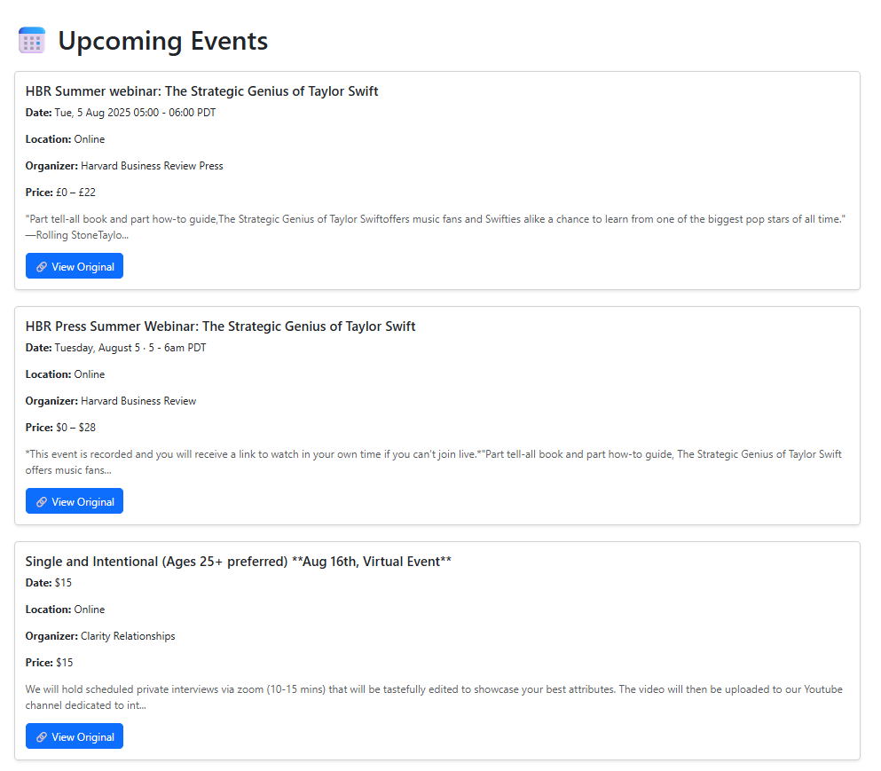
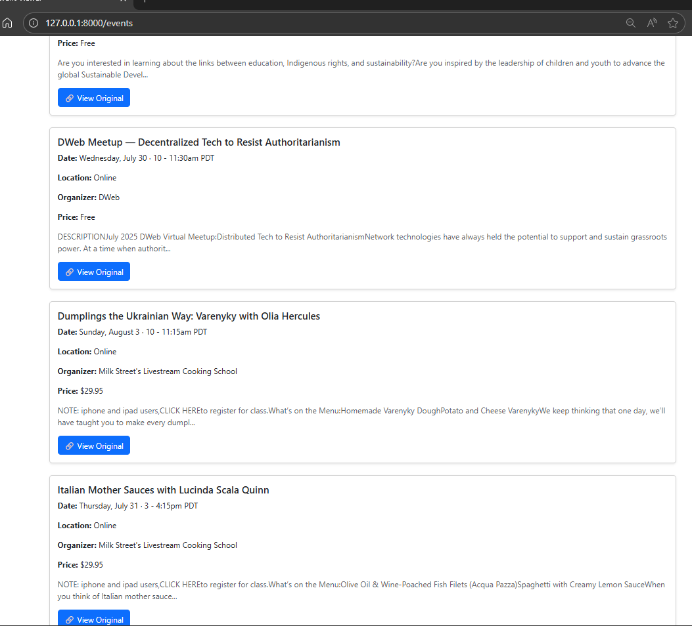

# 🗓️ Event Scraper & Laravel Frontend Integration

This project is a full-stack application that scrapes event data from a public events website (e.g., Eventbrite), stores the data in a MySQL database using Python, and displays the results via a Laravel-based frontend.

---

## 🔧 Project Structure

```
event_scraper_project/
│
├── scraper/                   # Python scrapers
│   └── site1_scraper.py       # Scrapes event URLs and details
│
├── database/                  # MySQL database interaction
│   ├── db_config.py           # Connection setup
│   └── model.py               # SQL insert logic
│
├── laravel-frontend/          # Laravel 10 application
│   └── resources/views/       # Blade templates
│
├── testsql.py           
├── requirements.txt
├── main.py                    # Main script to run scraping process
└── README.md
```

---

## 🧠 How It Works

### 1. 🔍 Web Scraping

- We scrape **5 pages** of the event listing site using BeautifulSoup and requests.
- From each listing page, we extract **event detail page URLs**.
- For each event URL, we fetch:
  - Event title
  - Date and time
  - Location
  - Organizer
  - Description
  - Tags or category (if available)

### 2. 🛢️ Storing in MySQL

- We use Python's `mysql.connector` to connect to a MySQL database.
- The extracted event data is inserted into a structured `events` table.
- Duplicate entries are avoided using a unique constraint on the event URL or title.

### 3. 🌐 Laravel Frontend

- The Laravel frontend fetches data from the `events` table.
- A simple Blade view lists all events in a paginated table with:
  - Title
  - Date
  - Location
  - Description preview
- You can run the Laravel frontend with:

```bash
cd laravel-frontend
php artisan serve
```

View it in the browser: [http://127.0.0.1:8000/events](http://127.0.0.1:8000/events)

---

## 🚀 Running the Scraper

Make sure your MySQL server is running and the database is set up. Then run:

```bash
python main.py
```

It will:
- Scrape 5 pages
- Extract URLs and event details
- Store all results into the connected MySQL database

---

## ✅ Requirements

- Python 3.10+
- Laravel 10
- MySQL server
- Python packages listed in `requirements.txt`

Install Python dependencies:

```bash
pip install -r requirements.txt
```

---

## 🔒 Environment

Ensure your `.env` files (for both Python and Laravel) have correct DB credentials.

Example for Python `db_config.py`:

```python
DB_CONFIG = {
    'host': 'localhost',
    'user': 'root',
    'password': 'yourpassword',
    'database': 'events_db'
}
```

---

## 📸 Screenshots

### Laravel Events Page






## 📄 License

This project is for educational and portfolio purposes.
